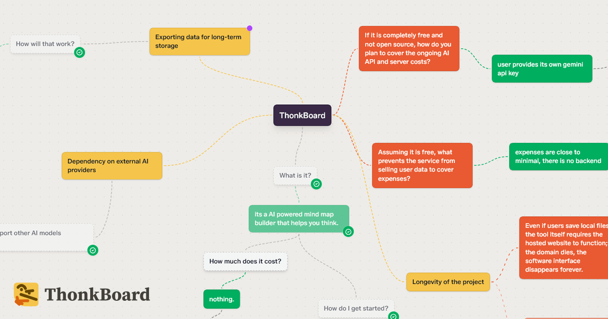

# ThonkBoard

**[thonkboard.com](https://thonkboard.com)** - a spatial canvas for building and pressure-testing ideas. No backend, no accounts, no server. Everything runs in the browser.



## What it does

You build a graph of ideas. Each node is a thought. AI can question, critique, propose, and argue around any node. Questions wait for answers. Answers get approved and integrated back into the parent - rewriting it in place with what you learned.

## Getting started

```bash
npm install
npm run dev
```

Add an AI key via the "Set AI key" button in the top bar. Keys are stored in `localStorage` only, sent directly to your chosen provider.

## AI providers

| Provider | Free tier | Notes |
|----------|-----------|-------|
| Google Gemini | Yes | Default. Gemini 3.1 Flash Lite / Gemini 3.5 Flash. |
| OpenAI | No | GPT-4o mini / GPT-4o |
| Anthropic | No | Claude Haiku / Claude Sonnet |
| DeepSeek | No | deepseek-chat / deepseek-reasoner. |
| Ollama | Local only | Requires running ThonkBoard locally - Ollama blocks cross-origin requests (CORS). |

**Turbo Thonking** switches to the smarter model for the active provider.

## Browser & installation

**Chrome is recommended.** ThonkBoard uses the File System Access API for silent saves (Ctrl+S without a download prompt) - this only works in Chromium-based browsers. Firefox works but saves always trigger a download.

You can also install ThonkBoard as a PWA from Chrome's address bar ("Install ThonkBoard"). The installed app can be set as the default handler for `.thonk` files, so double-clicking a board file opens it directly.

## Privacy

No server. Nothing you type leaves your browser. AI calls go directly to your provider using your own key. With Ollama, everything is local.

Don't use ThonkBoard in incognito - browsers wipe `localStorage` on close.

## Tech stack

- **Vite + React + TypeScript**
- **@xyflow/react v12** - spatial canvas, controlled mode
- **Tailwind CSS v4** - `@theme {}` tokens, no `tailwind.config.js`
- **shadcn/ui** - manually installed (CLI incompatible with Tailwind v4)
- **Google Gemini / OpenAI / Anthropic / DeepSeek / Ollama**

## License

[Polyform NonCommercial 1.0.0](LICENSE) - free for personal, educational, and internal business use. Commercial use requires permission.
